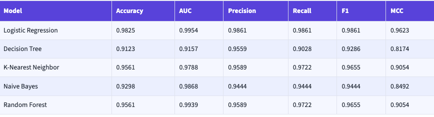
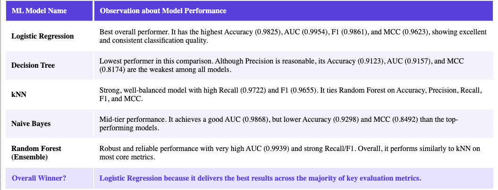

# ML Classification Models - Breast Cancer Prediction

## Problem Statement

The objective of this project is to build and compare multiple machine learning classification models to predict breast cancer diagnosis. The models are trained and evaluated on comprehensive metrics to determine which classifier provides the best predictive performance for this medical classification problem.

This assignment demonstrates a complete end-to-end machine learning workflow including:

- Data preprocessing and feature scaling
- Training multiple classification algorithms
- Computing comprehensive evaluation metrics
- Building an interactive web interface for model comparison and predictions
- Evaluating model performance through various metrics

## Dataset Description

### Dataset: Breast Cancer Wisconsin (Diagnostic)

**Source**: Scikit-learn Built-in Dataset

**Problem Type**: Binary Classification

**Instances**: 569 samples

- Malignant (positive class): ~212 samples
- Benign (negative class): ~357 samples

**Features**: 30 numerical features derived from digitized images of fine needle aspirate (FNA) of breast mass

**Feature Categories**:

1. Radius (mean, standard error, worst)
2. Texture (mean, standard error, worst)
3. Perimeter (mean, standard error, worst)
4. Area (mean, standard error, worst)
5. Smoothness (mean, standard error, worst)
6. Compactness (mean, standard error, worst)
7. Concavity (mean, standard error, worst)
8. Concave points (mean, standard error, worst)
9. Symmetry (mean, standard error, worst)
10. Fractal dimension (mean, standard error, worst)

**Data Characteristics**:

- No missing values
- Numerical features only
- Features are scaled to standardized range [0, 1]
- Binary target: 0 (Benign), 1 (Malignant)

**Train-Test Split**: 80% training (455 samples), 20% testing (114 samples)

## Github Repository Link

This project is maintained on GitHub with all required files and documentation:

**Repository**: [ML Classification Project](https://github.com/samsadahmad/bits_ml_classification)

**Contents**: All source code, datasets, trained models, results, and documentation are available in the repository.

## Repository Structure

```
ml_classification_project/
│
├── app.py                      # Streamlit web application
├── train_models.py             # Model training pipeline script
├── requirements.txt            # Python dependencies
├── README.md                   # This file
│
├── model/                      # Directory containing saved models
│   ├── logistic_regression.pkl
│   ├── decision_tree.pkl
│   ├── k-nearest_neighbor.pkl
│   ├── naive_bayes.pkl
│   ├── random_forest.pkl
│   └── scaler.pkl
│
├── dataset.csv                 # Original dataset
├── test_data.csv               # Test data with predictions
└── model_results.csv           # Evaluation metrics results
```

## Models Used

This project implements and evaluates 5 distinct classification algorithms:

### 1. Logistic Regression

- **Type**: Linear classifier
- **Algorithm**: Uses sigmoid function to map predictions to [0, 1]
- **Advantages**: Fast, interpretable, good for linearly separable data
- **Hyperparameters**: max_iter=1000, random_state=42

### 2. Decision Tree Classifier

- **Type**: Tree-based non-linear classifier
- **Algorithm**: Recursively splits data based on feature importance
- **Advantages**: Handles non-linear relationships, interpretable decision paths
- **Hyperparameters**: random_state=42, no depth limit

### 3. K-Nearest Neighbor (kNN)

- **Type**: Instance-based lazy learner
- **Algorithm**: Classifies based on majority vote of k nearest neighbors
- **Advantages**: Simple, effective for local patterns
- **Hyperparameters**: n_neighbors=5

### 4. Naive Bayes (Gaussian)

- **Type**: Probabilistic classifier
- **Algorithm**: Based on Bayes theorem with independence assumption
- **Advantages**: Fast, good for probabilistic interpretation
- **Hyperparameters**: Default Gaussian parameters

### 5. Random Forest (Ensemble)

- **Type**: Ensemble of decision trees
- **Algorithm**: Bootstrap aggregating with multiple decision trees
- **Advantages**: Reduces overfitting, handles high-dimensional data well
- **Hyperparameters**: n_estimators=100, random_state=42

## Evaluation Metrics

For each model, the following 6 evaluation metrics are calculated:

### 1. **Accuracy**

- Formula: (TP + TN) / (TP + TN + FP + FN)
- Definition: Proportion of correct predictions among all predictions
- Interpretation: Overall correctness of the model

### 2. **AUC Score (Area Under ROC Curve)**

- Range: [0, 1] where 0.5 = random classifier, 1.0 = perfect classifier
- Definition: Probability that model ranks a random positive example higher than negative
- Interpretation: Model's ability to distinguish between classes

### 3. **Precision**

- Formula: TP / (TP + FP)
- Definition: Among predicted positives, how many are actually positive
- Interpretation: Reliability of positive predictions (minimize false positives)

### 4. **Recall (Sensitivity)**

- Formula: TP / (TP + FN)
- Definition: Among actual positives, how many are correctly identified
- Interpretation: Completeness of finding all positive cases (minimize false negatives)

### 5. **F1 Score**

- Formula: 2 × (Precision × Recall) / (Precision + Recall)
- Definition: Harmonic mean of precision and recall
- Interpretation: Balanced measure when there's class imbalance

### 6. **Matthews Correlation Coefficient (MCC)**

- Range: [-1, 1] where 1 = perfect prediction, 0 = random prediction
- Formula: (TP×TN - FP×FN) / √[(TP+FP)(TP+FN)(TN+FP)(TN+FN)]
- Interpretation: Balanced measure for binary classification

**Legend**: TP (True Positive), TN (True Negative), FP (False Positive), FN (False Negative)

## Model Performance Comparison



## Observations on Model Performance



---

## Installation & Setup

### Prerequisites

- Python 3.8 or higher
- pip (Python package manager)

### Installation Steps

1. **Clone or download the repository**:

```bash
cd ml_classification_project
```

2. **Create a virtual environment** (recommended):

```bash
python -m venv venv
source venv/bin/activate  # On Windows: venv\Scripts\activate
```

3. **Install dependencies**:

```bash
pip install -r requirements.txt
```

## Usage

### 1. Train Models

Run the training pipeline to train all 6 models and generate evaluation metrics:

```bash
python train_models.py
```

This will:

- Load the Breast Cancer dataset
- Preprocess and split data (80% train, 20% test)
- Train all 5 classification models
- Calculate 6 evaluation metrics for each model
- Save trained models to `model/` directory
- Generate `model_results.csv` with all metrics
- Save test data with predictions to `test_data.csv`

**Expected Output**:

```
============================================================
Starting Model Training Pipeline
============================================================
Loading Breast Cancer dataset...
Dataset shape: (569, 30)
Features: 30, Instances: 569
...
[Training output for each model]
...
============================================================
All models trained successfully!
============================================================
Saving results to CSV...
Saved: model_results.csv
```

### 2. Run Streamlit Application

Launch the interactive web application:

```bash
streamlit run app.py
```

The app will be available at: `http://localhost:8501`

**Features**:

- **Model Comparison**: View and compare metrics across all models
- **Predictions**: Upload test data and make predictions using any model
- **Visualizations**: Interactive charts and confusion matrices
- **Model Details**: Information about each classifier

## File Descriptions

### Main Files

**train_models.py**

- Contains `MLClassificationPipeline` class
- Implements data loading, preprocessing, and model training
- Calculates all evaluation metrics
- Saves models and results

**app.py**

- Streamlit web application
- Interactive dashboard for model comparison
- Prediction interface with file upload
- Visualization of results and metrics

**requirements.txt**

- Lists all Python dependencies with versions
- Include scikit-learn, streamlit, pandas, numpy, matplotlib, seaborn, plotly

### Data Files (Generated after running train_models.py)

**dataset.csv**

- Original dataset with all 30 features and target variable

**test_data.csv**

- Test set data with actual labels and predictions from all models

**model_results.csv**

- Summary of evaluation metrics for all models

### Model Files (Saved in model/ directory)

**\*.pkl files**

- Serialized trained models for each classifier
- Used by Streamlit app for making predictions

**scaler.pkl**

- StandardScaler object used for feature normalization
- Ensures consistent preprocessing for new predictions

## Dependencies

See `requirements.txt` for complete list:

- streamlit - Web application framework
- scikit-learn - Machine learning library
- numpy - Numerical computing
- pandas - Data manipulation
- matplotlib - Static visualization
- seaborn - Statistical visualization
- plotly - Interactive visualization
- joblib - Model serialization (installed with scikit-learn)

## Performance Notes

### Advantages & Disadvantages Summary

**Logistic Regression**

- ✅ Fast, interpretable, good for linearly separable problems
- ❌ May underperform on non-linear patterns

**Decision Tree**

- ✅ Highly interpretable, handles non-linear relationships
- ❌ Prone to overfitting without pruning

**K-Nearest Neighbor**

- ✅ Simple, no training phase needed
- ❌ Sensitive to feature scaling, slow for large datasets

**Naive Bayes**

- ✅ Fast, probabilistic predictions
- ❌ Assumes feature independence (often violated)

**Random Forest**

- ✅ Robust, handles high-dimensional data, reduces overfitting
- ❌ Less interpretable, computationally intensive
